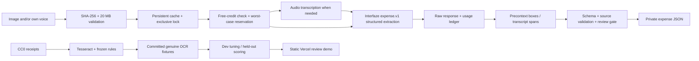

# SayIt BillIt

**Evidence-first expenses. An honest, incomplete pilot—not production bookkeeping software.**

A typed TypeScript library and small review app for freelancers and shop owners.
Select a value to highlight its receipt evidence; correct it or explicitly confirm
it is unknown, then export original predictions plus a separate human audit trail.

Public app: deployment URL is recorded in `docs/DELIVERY.md`.
Source: https://github.com/imranrkhan13/sayit-billit

## What shipped

- Nine original CC0 synthetic receipts, frozen 3 dev / 6 held-out split, source/license
  manifest, exact data hashes, authored labels, and a published labeling rubric.
- Real cached Tesseract.js OCR and rules predictions; no hard-coded Interfaze output.
- Versioned `expense.v1` JSON schema, evidence links, review reasons and scores.
- Local Interfaze image / voice / combined CLI: transcription first for audio,
  then structured extraction, raw precontext grounding, env-only keys, persistent
  response cache, usage ledger, budget reservations, and fail-closed behavior.
- Static Vercel-compatible demo, offline CI, MIT code and one-command reproduction.

**Pending:** free Interfaze account/key confirmation; real Interfaze predictions and
comparison; user-recorded voice corpus; implemented whisper.cpp baseline; independent
human labels. The API adapter follows current docs but has not been live-validated.
New extraction is CLI-only; public upload is explicitly a local preview, not inference.

## Reproduce

Node 22 required. From a fresh clone:

```sh
npm ci && npm run reproduce
```

This tests cache/failure/evidence behavior, scores committed real OCR fixtures, and
builds the demo without an API key or model calls. Dependency installation requires
network; tests and scoring do not. `npm run dev` opens a local Vite server.
`npm run baseline` reruns missing OCR fixtures using Tesseract.js 6 English; the first
run downloads language data. Existing predictions are retained. Latency in replay
reports is the saved original inference latency, not replay latency.

For live local extraction, first confirm your account has enough **unused free**
credits and no paid billing/top-up. Store credentials in your shell environment,
never source control. `.env.example` documents settings; it is not auto-loaded.

```sh
export INTERFAZE_API_KEY='your-key' # or AI_GATEWAY_API_KEY, never both
export FREE_CREDIT_CONFIRMED=true
export TOKEN_CAP=2000000
export CREDIT_CAP_USD=5 # lower this to your verified remaining free balance
npm run extract -- /path/to/receipt.png
npm run extract -- /path/to/your-voice.wav
npm run extract -- /path/to/receipt.png /path/to/your-voice.wav
```

Do not paste credentials into the app. Local output and raw responses remain in
`.private/`. Nothing from that directory is automatically published. Same input bytes
and stage never trigger a second request, even after prompt changes. Missing key,
low cap, quota error, timeout, invalid schema, or missing usage stops the run with
an explicit error. There is no automatic retry or paid fallback.

## Architecture



## Honest evaluation

Initial run: 2026-09-27, six held-out synthetic images, 54 field slots. Small sample,
shared rendering family, single agent-authored labels—not a real-world benchmark.
No winner can be declared. Full per-field counts, predictions, data hashes, config,
latencies, and source commit are in `data/eval/report.json`.

| Measure | Tesseract + rules | Interfaze | whisper.cpp tiny |
|---|---:|---:|---:|
| Held-out documents | 6 | 0, not run | 0, not run |
| Field accuracy | 52/54 = 96.30% | N/A | N/A |
| Wrong fields flagged | 1/2 = 50% | N/A | N/A |
| Flag precision | 1/4 = 25% | N/A | N/A |
| Review rate | 4/54 = 7.41% | N/A | N/A |
| Accepted wrong fields | 1 | N/A | N/A |
| Mean inference latency | 103.22 ms | N/A | N/A |
| API tokens / document | 0 | N/A | N/A |
| API dollars / document | $0 | N/A | N/A |

| Field | Precision | Recall | Accuracy |
|---|---:|---:|---:|
| Merchant | 100% | 100% | 100% |
| Date | 100% | 100% | 100% |
| Currency | 100% | 100% | 100% |
| Tax | 100% | 100% | 100% |
| Total | 100% | 83.33% | 83.33% |
| Item name | 91.67% | 91.67% | 91.67% |
| Item price | 100% | 100% | 100% |

The dev objective chose threshold **0** because all dev predictions were correct,
and ties favored the lower threshold. This degenerate result is intentionally
reported unchanged: three clean/easy development examples cannot tune a trustworthy
gate. It is **not** used for Interfaze. All Interfaze fields are review-only until
engine-specific calibration exists. Public demo scores are OCR recognition scores.

Confident-wrong example: `test-03`, item 2 name: printed **Oil**, predicted **0il**,
score **0.92**, incorrectly accepted. `test-05` total: **24.20** after “BALANCE DUE”
was missed by the frozen TOTAL-only rule and correctly flagged. See the original
images and raw OCR in `data/`; do not fix rules on this held-out set and re-report it
as an untouched benchmark. Electricity/hardware costs are excluded from $0 API cost.

## Limits and safety

- Real receipt photos, handwriting, locale variation, refunds, multiple pages,
  quantities, discounts, and reconciliation are not validated.
- No confidence score is a guarantee. Field/source semantic matching is conservative
  but not a proof of truth. Exact quotes with multiple matches require review.
- Media preprocessing can consume unknown tokens. Reserve the full documented
  1M input + 32K output ceiling ($1.612), then settle actual usage. Caps default to zero.
  An eval cannot be promised to fit an unknown free balance; execution remains blocked
  until it is verified. Default caps can refuse calls with small free allocations.
- Up to 20 MB per input, 300-second request timeout, one call/second. Local disk cache
  is appropriate for one machine, **not** an ephemeral Vercel function filesystem.
- Public demo has no inference endpoint or secrets; it cannot drain an API balance.
- Missing/ambiguous values remain null. Human changes are separate from machine data.
- Labels are authored from the synthetic source and visually checked, not an
  independently hand-labeled human dataset. Audio has no samples or measurements.
- No successful Interfaze response exists in this repository. Protocol tests use
  explicitly labeled test transport envelopes, not pretend Interfaze predictions.

## Research sources and stretch work

Read before implementation: [Interfaze docs](https://interfaze.ai/docs),
[pricing](https://interfaze.ai/pricing), [precontext](https://interfaze.ai/docs/precontext),
[structured outputs](https://interfaze.ai/docs/structured-output),
[limits](https://interfaze.ai/docs/limits),
[Vercel model listing](https://vercel.com/ai-gateway/models/interfaze-beta),
[Gateway pricing](https://vercel.com/docs/ai-gateway/pricing),
[lev model card](https://huggingface.co/interfaze-ai/lev).
Pricing checked September 27, 2026: $1.50/M input, $3.50/M output. Direct signup
advertises no card; Gateway advertises $5/30 days for users who have not paid.
Neither establishes this account's current usable balance.

Optional stretch **not implemented**: lev as an accept/review classifier. Its
Qwen3.5-4B adapter needs roughly 8 GB base weights plus adapter, Python 3.12+, and
CUDA for real-time use. Its task probabilities still require expense-specific
validation; it does not replace extraction or source grounding.

See [labeling](docs/LABELING.md), [audio status](docs/AUDIO.md),
[security](docs/SECURITY.md), and the [one-page write-up](docs/WRITEUP.md).
